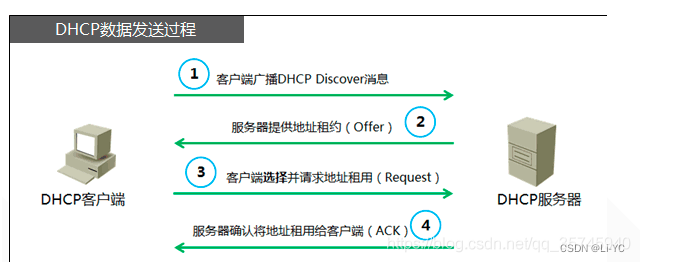

#DHCP 协议

###作用

1、DHCP可以自动分配IP、子网掩码、网关、DNS。
2、DHCP客户端使用的端口是68，服务端端口是67，使用的UDP应用层的协议。
3、DHCP一般不为服务器分配IP,因为它们要使用固定IP,所以DHCP一般只为办公环境的主机分配IP
4、DHCP服务器和客户端需要在一个局域网内，在为客户端分配IP的时候需要进行多次广播，但DHCP也可以为其它网段内的主机分配IP，只要连接二个网段中间的路由器能转发DHCP配置请求即可，但这要求路由器配置中继功能。

###DHCP交互过程图

###DHCP续租
1、在使用租期过去50%时刻处， 客户端向服务器发送单播DHCP REQUEST报文续延租期。
2、如果收到服务器的DHCP ACK报文，则租期相应向前延长，续租成功。如果没有收到DHCP ACK报文，则客户端继续使用这个IP地址。在使用租期过去**87.5%**时刻处，向服务器发送广播DHCP REQUEST报文续延租期。
3、如果收到服务器的DHCP ACK报文，则租期相应向前延长，续租成功。如果没有收到DHCP ACK报文，则客户端继续使用这个IP地址。在使用租期到期时，客户端自动放弃使用这个IP地址，并开始新的DHCP过程
