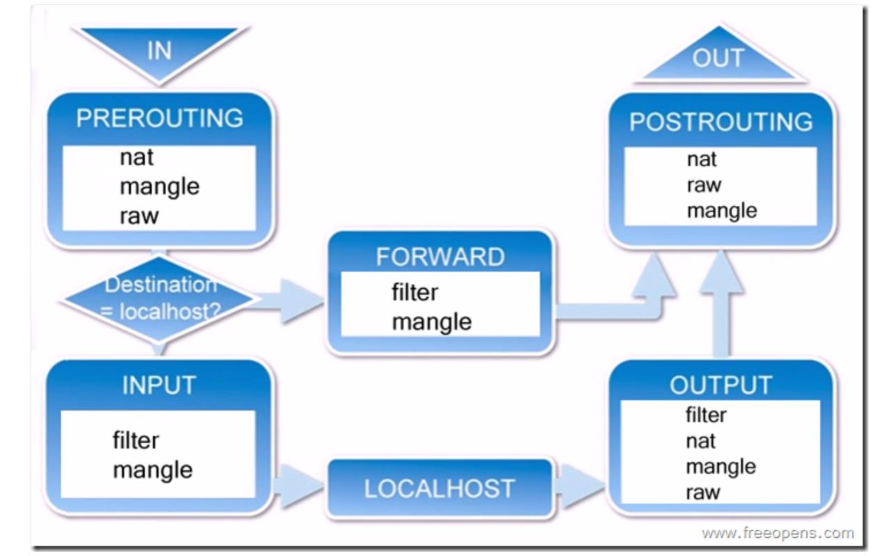

## netfilter/iptable

iptables是linux 防火墙的管理工具，真正实现防火墙功能的是netfilter.

## 规则表
filter    过滤数据包  (input output forword)
nat       网络地址转换（prerouting postrouting output）
mangle    修改数据包的服务类型，TTL,配置路由实现QOS内核模块。 （都可以）
raw       决定数据包是否被状态跟踪  （output prerouting）
优先级   
Raw >mangle  > nat  > filter

## 规则链

input  
output  
forward  
prerouting  
postrouting  

## linux 查看进程堆栈和状况

strace -p -tt 进程ID
pstack  进程ID  

